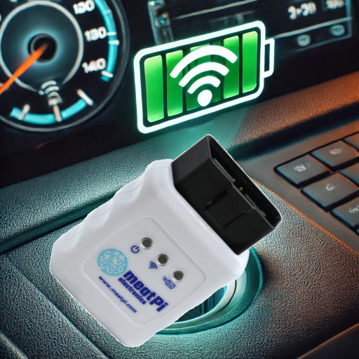

<a href="https://github.com/camueller/wican-soc/blob/master/README_EN.md">&nbsp;&nbsp;</a>[This documentation is available in English](README_EN.md).

# WiCAN SoC

Mit WiCAN SoC kann der **SoC (State of Charge) eines Fahrzeugs via MQTT verfügbar gemacht werden** für Smart Home Steuerungen oder Wallboxen. Dazu wird ein [WiCAN ODB2 Adapter von MeatPi](https://www.meatpi.com/products/wican) benötigt, welcher **permanent im Fahrzeug eingesteckt** bleibt.

## Funktionsweise
Wenn sich das Fahrzeug dem Haus nähert, verbindet sich der **WiCAN mit dem WLAN** und sendet eine **MQTT-Nachticht**, dass er **online** ist. Darauf wartet das [wican-status.sh](https://raw.githubusercontent.com/camueller/wican-soc/refs/heads/main/wican-status.sh)-Script und **fordert den SoC an** mittels einer MQTT-Nachricht. Auf die Antwort wartet das [wican-soc.sh](https://raw.githubusercontent.com/camueller/wican-soc/refs/heads/main/wican-soc.sh)-Script, welches den **SoC extrahiert** und zusammen mit einem Timestamp als **MQTT-Nachricht (mit Retained-Flag) publiziert**.

Ca. 3 Minuten nach dem Abschalten des Fahrzeugs **schaltet sich der WiCAN ODB2-Adapter aus**, um die Fahrzeug-Batterie nicht zu belasten. Die MQTT-Nachricht mit Retained-Flag ist aber weiterhin für Smart Home Steuerungen oder Wallboxen verfügbar, damit **beim Verbinden des Fahrzeugs mit der Wallbox der SoC bekannt** ist, auch wenn der WiCAN ODB2-Adapter und der CAN-Bus des Fahrzeugs inzwischen ausgeschaltet sind.

## Unterstützte Fahrzeuge
Der WiCAN kommuniziert mit dem CAN-Bus des Fahrzeugs (wie Diagnose-Geräte in der Werkstatt auch), um den SoC des Fahrzeugs zu ermitteln. Diese Kommunikation ist **spezifisch für Fahrzeug-Hersteller und teilweise auch Modelle**. Wenn das Fahrzeug von `wican-soc` bereits unterstützt wird, muss man sich um die diesen Aspekt nicht kümmern.

**Aktuell werden folgende Fahrzeug-Hersteller / Modelle unterstützt:**

- Nissan: Leaf ZE1

Für die Unterstützung weiterer Fahrzeug-Hersteller / Modelle bin ich auf die **Mithilfe durch User** angwiesen. Oft finden sich die benötigten Informationen in einschlägigen Foren der Fahrzeughersteller oder Wallboxhersteller. Alternativ lassen sich diese Informationen auch mittels **Apps wie "Car Scanner"** ermitteln, welche vom WiCAN-OBD2-Adapter unterstützt wird.

Weil ich die so ermittelten Angaben zur CAN-Bus-Kommunikation nicht selbst testen kann, möchte ich sie hier auch nicht einfach blind übernehmen. Ich bin aber gern behilflich bei der [Erstellung neuer Profile](new_profile.md) für `wican-soc`.

## Technische Details
`wican-soc` besteht aus mehreren Shell-Scripts, die auf einem **24x7-Linux-System** laufen. Hinsichtlich der Performance gibt es keine hohen Anforderungen, d.h. ein Raspberry Pi oder ein NAS sollten völlig ausreichen.

### [Installation](installation.md)

### [WiCAN-Konfiguration](wican-configuration.md)
