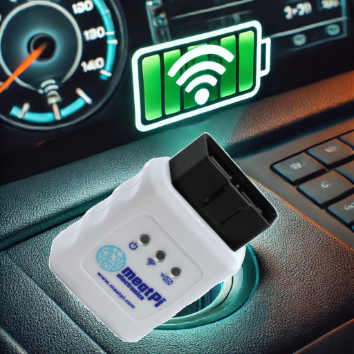

# WiCAN SoC

With WiCAN SoC, the **SoC (State of Charge) of a vehicle can be provided via MQTT** for smart home controls or wallboxes. This requires a [WiCAN ODB2 adapter from MeatPi](https://www.meatpi.com/products/wican), which remains **permanently plugged in** into the vehicle.

## How it works
When the vehicle approaches the house, the **WiCAN connects to the WiFi** and sends an **MQTT message** that it is **online**. The [wican-status.sh](https://raw.githubusercontent.com/camueller/wican-soc/refs/heads/main/wican-status.sh) script waits for this and **requests the SoC** using an MQTT message. The [wican-soc.sh](https://raw.githubusercontent.com/camueller/wican-soc/refs/heads/main/wican-soc.sh) script is waiting for the answer. It **extracts the SoC** and publishes it with a timestamp as an **MQTT message (with retained flag)**.

Approximately 3 minutes after switching off the vehicle, the WiCAN ODB2 adapter switches off in order not to put a strain on the vehicle battery. However, the MQTT message with retained flag is still available for smart home controls or wallboxes so that **the SoC is available when connecting the vehicle to the wallbox**, even if the WiCAN ODB2 adapter and the vehicle's CAN bus are now switched off.

## Supported vehicles
The WiCAN communicates with the vehicle's CAN bus (like diagnostic devices in the workshop) to determine the vehicle's SoC. This communication is **specific for vehicle manufacturers and sometimes models**. If the vehicle is already supported by `wican-soc`, you don't have to worry about this aspect.

**The following vehicle manufacturers/models are currently supported:**

- Nissan: Leaf ZE1

To support other vehicle manufacturers/models, **I rely on the help of users**. The information needed can often be found in relevant forums run by vehicle manufacturers or wallbox manufacturers. Alternatively, this information can also be determined using **apps such as “Car Scanner”**, which is supported by the WiCAN OBD2 adapter.

Because I cannot test the information about CAN bus communication determined in this way myself, I don't want to just blindly adopt it here. However, I would be happy to help with [creating new profiles](new_profile_EN.md) for `wican-soc`.

## Technical details
`wican-soc` consists of several shell scripts that run on a **24x7 Linux system**. There are no high requirements in terms of performance, i.e. a Raspberry Pi or a NAS should be completely sufficient.

### [Installation](installation_EN.md)

### [WiCAN configuration](wican-configuration_EN.md)
